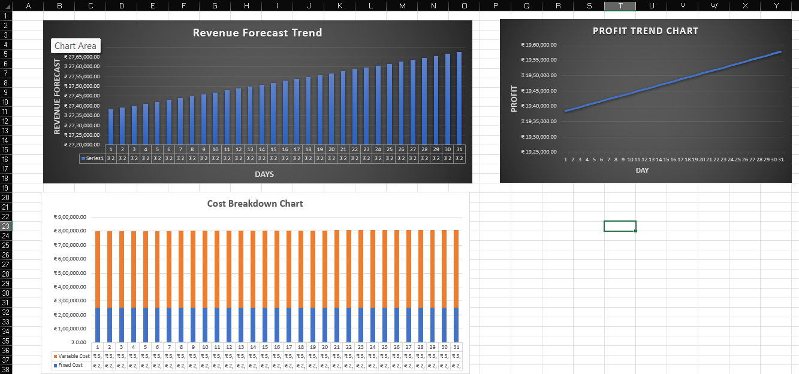
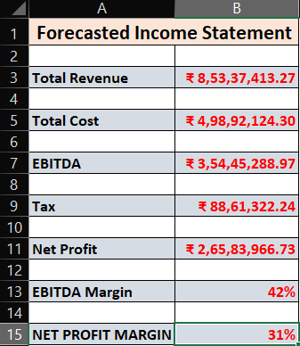
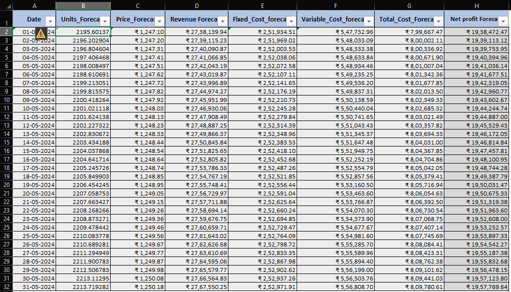

# Financial Budget Forecasting Model

## Overview

This repository contains an Excel-based financial budgeting and forecasting model. The model uses key financial assumptions to generate projected financial results and summarize them through an income statement.

Such models are commonly used in organizations to support budgeting, financial planning, and performance analysis.

---

## Purpose of the Model

This model helps in:

* Estimating future financial performance
* Understanding how assumptions affect financial outcomes
* Supporting budgeting and financial planning
* Summarizing projected results in a structured format

Organizations often use similar models to assist in **decision-making, planning, and evaluating financial performance**.

---

## Tools Used

* **Microsoft Excel**
* Financial Forecasting Techniques
* Basic Financial Modeling
* Income Statement Analysis

---

## Repository Contents

* **Financial_Budget_Forecasting_Model.xlsx** – Main Excel forecasting model
* **images/** – Folder containing screenshots of different model sections

---

## Model Screenshots

### Model Overview

### Input Assumptions

### Financial Forecast Table

### Income Statement Summary

---

## Model Components

The model consists of the following sections:

**Input Assumptions**
Key financial variables used to generate projections.

**Financial Forecast Table**
Displays projected financial values generated from the assumptions.

**Income Statement Summary**
Provides a structured summary of financial outcomes including revenue, expenses, and profit.

---

## How to Use

1. Download the Excel file from this repository.
2. Open **Financial_Budget_Forecasting_Model.xlsx** in Microsoft Excel.
3. Modify values in the **Input Assumptions** section.
4. The forecast table and income statement summary will update automatically.

---

## Author

**Manjesh Kushwaha**

🎓 MBA (Finance) Aspirant  
📊 Interested in Data Analytics & Business Intelligence  

If you like this project, feel free to ⭐ the repository.
